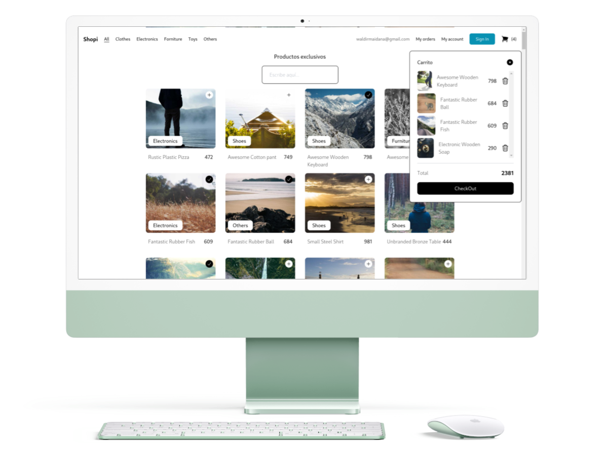
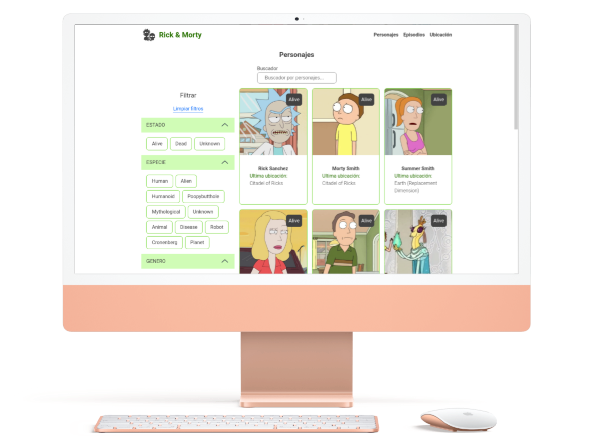

<h1 align="center">Hola, soy <a href="https://aristi.dev">Waldir Maidana</a> 👋</h1>

<!--- snake -->

  </a>

## Sobre mi

-   ⭐ Ingeniero de sistemas ⭐
-   Desarrollador FrontEnd 
     

## Proyectos destacados

<table>
<tr>
<td width="50%">
<h3 align="center">Shopi</h3>

Web app que consume la API de Platzi FakeStore en la cual se muestran productos filtrados por categorias o titulo. Ademas que se trabaja con un carrito de compras.

                                                                                      
</td>

<td width="50%">
                
<h3 align="center">Rick and Morty</h3>

                                       

 

Web app que consume la API publica de Rick and Morty en la cual se muestra a todos los personajes según algunas caracteristicas, episodios o ubicación

                                                             
</table>                                                                                 

 

### ⚙️ &nbsp;GitHub Analytics

